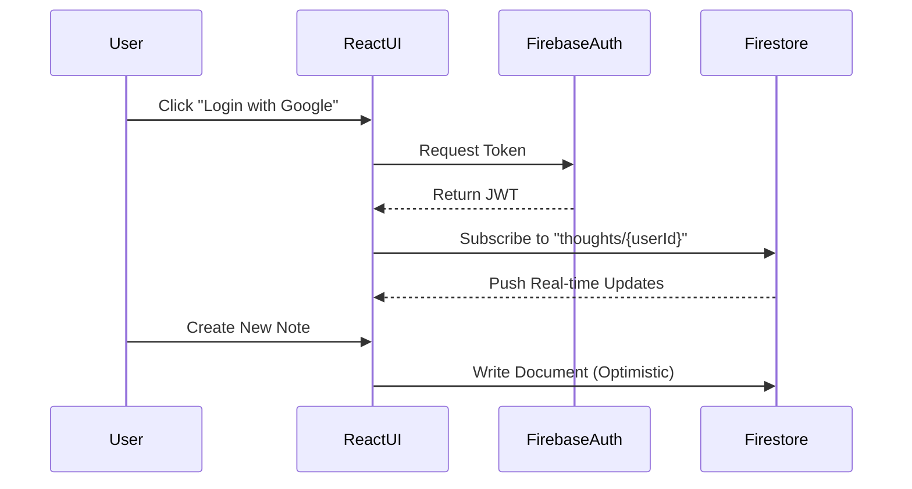

# ☁️ Cloudkeep (SaaS Platform)

A secure, scalable note-taking thought management system built for the modern cloud. Leveraging **Firebase's serverless infrastructure**, it delivers enterprise-grade authentication, real-time data synchronization, and a rich media experience.

## 🚀 Key Engineering Features

*   **Security-First Architecture:**
    *   **OAuth 2.0 Authentication:** Seamless Google Sign-In via Firebase Auth using JWT tokens.
    *   **Row-Level Security (RLS):** Firestore security rules strictly enforcing data isolation—users can only access their own thoughts.
*   **Complex State Management:**
    *   **Optimistic UI Updates:** Instant feedback for create/edit operations while syncing in the background.
    *   **Custom Hooks:** Encapsulated logic (`useAuth`, `useThoughtManager`) for modularity and testing.
*   **Rich Media Handling:**
    *   Integrated **Firebase Storage** for secure file/image uploads with signed URLs.
    *   Dynamic rendering of mixed content blocks (Rich Text + Media).
*   **Scalable Backend:**
    *   Built on **NoSQL (Firestore)** to handle millions of concurrent documents with sub-second latency.

## 🛠️ Tech Stack

| Component | Technology | Role |
| :--- | :--- | :--- |
| **Frontend** | React 18, Vite | High-Performance SPA |
| **Styling** | TailwindCSS, Lucide | Responsive, Accessible Design |
| **Inventory** | Firebase Firestore | NoSQL Real-time Database |
| **Identity** | Firebase Auth | Secure User Session Management |
| **Storage** | Firebase Storage | Blob Storage for User Assets |

## 🏗️ Architecture



## 📦 Installation & Setup

### 1. Repository Setup
```bash
git clone https://github.com/dineshingale/Cloudkeep-client.git
cd Cloudkeep-client
npm install
```

### 2. Environment Configuration
Create a `.env` file in the root. You need your own Firebase Project credentials.
```env
VITE_API_KEY=AIzaSy...
VITE_AUTH_DOMAIN=cloudkeep-prod.firebaseapp.com
VITE_PROJECT_ID=cloudkeep-prod
VITE_STORAGE_BUCKET=cloudkeep-prod.appspot.com
VITE_MESSAGING_SENDER_ID=843...
VITE_APP_ID=1:843...
```
*(Contact maintainer for dev environment credentials if contributing)*

### 3. Launch
```bash
npm run dev
```
*App accessible at `http://localhost:5173`*

## 📁 Project Structure
```
src/
├── components/      # Atomic Design UI Components
├── hooks/           # Business Logic (Separation of Concerns)
├── services/        # Firebase Service Abstractions
├── context/         # Global State (AuthProviders)
└── App.jsx          # Route Definitions
```

## 🤝 Contributing
We follow the **Gitflow** workflow.
1.  Fork & Clone
2.  Branch: `feature/rich-text-editor`
3.  Commit: `feat: Implement Draft.js for rich text`
4.  Pull Request: Target `main` branch.

---
*Demonstrating expertise in Cloud-Native Development, Security, and Modern Front-End Frameworks.*
